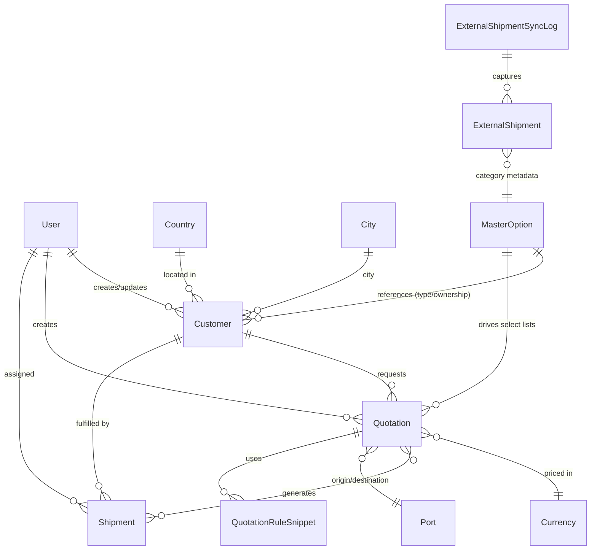

## Tuushin CRM

Tuushin CRM is a Next.js + Prisma application for managing quotations, external shipment data, and synchronized master data from the Tuushin freight ecosystem. This document highlights the domain model, key processes, and how to get the project running locally.

For client handover documentation, see:

- `docs/CLIENT_SYSTEM_DOCUMENTATION.md`
- `docs/DEPLOYMENT_RUNBOOK.md`
- `docs/DATABASE_AND_NEXTJS_GUIDE.md`

## Getting started

1. Install dependencies (pnpm is the default package manager):

   ```bash
   pnpm install
   ```

2. Copy environment variables and fill the required secrets:

   ```bash
   cp .env.example .env
   ```

3. Run the development database migrations and optional seed:

   ```bash
   pnpm prisma migrate dev
   pnpm prisma db seed   # optional, provides demo data
   ```

4. Start the dev server:

   ```bash
   pnpm dev
   ```

   The application is now available at [http://localhost:3000](http://localhost:3000).

## Domain entities overview

| Entity                 | Description                                                                                  | Key relationships                                                                              |
| ---------------------- | -------------------------------------------------------------------------------------------- | ---------------------------------------------------------------------------------------------- |
| `User`                 | Authentication entry for CRM staff and synced sales/manager accounts.                        | Creates/updates `Customer`, `Quotation`, `Shipment`, participates in rule snippets.            |
| `Customer`             | Companies or individuals requesting freight quotations.                                      | Linked to `Country`, `City`, owns many `Quotation` and `Shipment` records.                     |
| `Quotation`            | Core pricing document capturing routing, commercial terms, and computed profitability.       | References `Customer`, `User` (creator/owner), optional `Inquiry`, `Port` and `Currency` data. |
| `Shipment`             | Internal shipments derived from quotations.                                                  | Assigned to `User`, references `Customer`, mirrors external sync status.                       |
| `ExternalShipment`     | Tuushin external data synchronized from CRM integration.                                     | Groups by `ExternalShipmentSyncLog`, provides KPIs for dashboard metrics.                      |
| `MasterOption`         | Unified catalog of master data (type, ownership, country, port, area, sales, manager, etc.). | Drives dynamic selects on quotation forms and provisioning.                                    |
| `QuotationRuleSnippet` | Contains include/exclude/remark snippets applied to quotation documents.                     | Scoped by incoterm/transport mode, surfaced in quotation UI.                                   |

## Entity relationship diagram


```mermaid
erDiagram
	 User ||--o{ Customer : "creates/updates"
	 User ||--o{ Quotation : "creates"
	 User ||--o{ Shipment : "assigned"
	 Customer ||--o{ Quotation : "requests"
	 Customer ||--o{ Shipment : "fulfilled by"
	 Country ||--o{ Customer : "located in"
	 City ||--o{ Customer : "city"
	 Quotation }o--|| Currency : "priced in"
	 Quotation }o--o{ Shipment : "generates"
	 Quotation }o--|| Port : "origin/destination"
	 Quotation ||--o{ QuotationRuleSnippet : "uses"
	 ExternalShipmentSyncLog ||--o{ ExternalShipment : "captures"
	 ExternalShipment }o--|| MasterOption : "category metadata"
	 MasterOption ||--o{ Customer : "references (type/ownership)"
	 MasterOption ||--o{ Quotation : "drives select lists"
```

> ℹ️ The diagram focuses on the primary CRM flows. The Prisma schema (`prisma/schema.prisma`) contains additional supporting tables (authentication, inquiries, audit logs, etc.).

## Code style and git hooks

- Prettier enforces formatting and EditorConfig aligns core editor behavior.
- Husky + lint-staged auto-format staged files on commit and run a pre-push check.
- Run `pnpm format` to format the repo manually or `pnpm format:check` in CI.
- Hooks are configured through the `prepare` script. Re-run `pnpm prepare` if needed.

## Master data sync and user provisioning

- `POST /api/master/sync` imports external master options into `master_options`.
- `MASTER_SYNC_API_KEY` is required; requests must provide a matching `x-api-key`.
- During sync, active `SALES` and `MANAGER` entries provision login users with roles `SALES` / `MANAGER`.
- Emails default to `first.last@tuushin.local` (or use `meta.email` when supplied).
- `DEFAULT_USER_PASSWORD` sets the initial password (fallback: `ChangeMe123!`).
- `POST /api/master/provision-users` has been removed and now returns HTTP 410.
- Master sync implementation details are in `src/lib/master-sync.ts` and `src/app/api/master/sync/route.ts`.

After first login, users should update their password (UI flow forthcoming).

## External shipment sync automation

- `POST /api/external-shipments/cron` (also accepts `GET`) triggers a multi-category sync using the same dedupe logic as the admin UI.
- `EXTERNAL_SHIPMENT_CRON_SECRET` is required. Provide the secret through one of:
  - `x-cron-secret` header
  - `Authorization: Bearer <secret>` header (recommended for platform cron jobs)
  - `?secret=...` query parameter
- Optional environment variables fine-tune the job:
  - `EXTERNAL_SHIPMENT_CRON_WINDOW_DAYS` (defaults to 7) controls the rolling window.
  - `EXTERNAL_SHIPMENT_CRON_FILTER_TYPES` (defaults to `1,2`) configures upstream filter identifiers.
  - `EXTERNAL_SHIPMENT_CRON_CATEGORIES` defaults to `IMPORT,TRANSIT,EXPORT`.
  - `EXTERNAL_SHIPMENT_CRON_OVERLAP_DAYS` (defaults to `1`) re-pulls a small overlap from the last successful run.
  - `EXTERNAL_SHIPMENT_CRON_MAX_BACKFILL_DAYS` (defaults to `30`) limits automatic catch-up range after downtime.
- The handler returns a summary (`runs` + `summary`) that mirrors the manual sync response for observability and logging.
- Sync is idempotent per `(externalId, category)` via upsert logic, so repeated scheduled pulls update existing records instead of duplicating them.
- If a 6:00/18:00 run is missed (downtime), the next run auto-catches up from the latest successful sync log instead of skipping missed periods.
- This repo includes `vercel.json` with `0 6,18 * * *` schedule (twice daily) for automatic shipment pulling.
- Example Vercel Cron job (6:00 and 13:00 Ulaanbaatar time):

  ```json
  {
    "path": "/api/external-shipments/cron?secret=YOUR_GENERATED_SECRET",
    "schedule": "0 6,13 * * *",
    "timezone": "Asia/Ulaanbaatar",
    "method": "POST"
  }
  ```

  Adjust the schedule or supply `&windowDays=3&filters=1,2` query parameters when testing manual runs.
