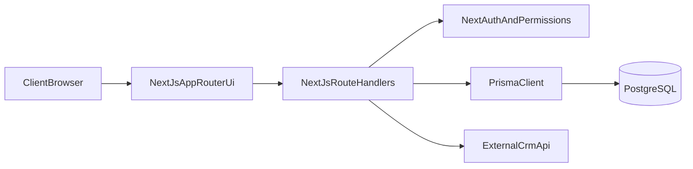

# Tuushin CRM Client System Documentation

This document explains how the system is organized, how requests flow, and which parts matter most for maintenance.

## 1) System overview

Tuushin CRM is a single Next.js application that contains:

- Web UI pages (App Router)
- API route handlers (`/api/*`)
- Authentication and authorization logic
- Database access through Prisma + PostgreSQL
- Integration sync jobs for master data and external shipments

There is no separate backend service; Next.js route handlers are the backend.

## 2) High-level architecture

## 3) Main code locations

- App routes and pages: `src/app`
- API endpoints: `src/app/api`
- Shared server/client logic: `src/lib`
- UI components: `src/components`
- Prisma schema and migrations: `prisma`
- Runtime migration helper: `scripts/migrate-if-ready.mjs`

## 4) Authentication and authorization

- Auth provider is configured in `src/lib/auth.ts` (NextAuth credentials).
- Session and JWT hold role and user identity used by API routes.
- Role rules are centralized in `src/lib/permissions.ts`.
- Most API handlers call auth/permission checks per route.

Important operational note:

- Protection is route-level (not global middleware), so each new endpoint should explicitly enforce auth and permissions.

## 5) Database model strategy

The schema is in `prisma/schema.prisma`.

Core domains:

- Users and roles (`ADMIN`, `MANAGER`, `SALES`)
- Quotations and quotation offers
- Master options and rule snippets
- External shipment sync logs and records
- Sales task tracking and audit logs

Current coexistence:

- `quotations` (normalized model)
- `app_quotations` (JSON payload model)

Both are present, so future changes must preserve compatibility unless a migration plan consolidates them.

## 6) Integration flows

### 6.1 Master data sync

- Endpoint: `POST /api/master/sync`
- Handler: `src/app/api/master/sync/route.ts`
- Service: `src/lib/master-sync.ts`
- Purpose: fetch and upsert reference options (country, port, sales, manager, incoterm, etc.)

Security behavior:

- If `MASTER_SYNC_API_KEY` is set, request must include matching `x-api-key`.
- If not set, route currently allows requests.

### 6.2 External shipment sync

- Endpoint: `POST /api/external-shipments/cron` (also supports `GET`)
- Handler: `src/app/api/external-shipments/cron/route.ts`
- Service: `src/lib/external-shipments.ts`

Security behavior:

- If `EXTERNAL_SHIPMENT_CRON_SECRET` is set, request must include it in header/query.
- If not set, route currently allows requests.

## 7) Configuration and environment

Base environment template: `.env.example`

Critical variables:

- DB: `DATABASE_URL`, `DIRECT_URL`
- Auth: `NEXTAUTH_URL`, `NEXTAUTH_SECRET`, `AUTH_SECRET`
- Sync security: `MASTER_SYNC_API_KEY`, `EXTERNAL_SHIPMENT_CRON_SECRET`
- External CRM credentials and source URLs

## 8) Known constraints for maintainers

- Some API handlers are large and include mixed responsibilities (validation, permission checks, business logic, mapping, persistence).
- Build currently allows lint errors (`next.config.ts` has `ignoreDuringBuilds: true`).
- Registration/provisioning behavior should be reviewed before production onboarding workflows are expanded.

## 9) Recommended ownership for client team

- Product/feature ownership: `src/app/(dashboard)` and business APIs under `src/app/api`
- Platform/ops ownership: Docker files, env management, DB migration process
- Data ownership: Prisma schema changes and migration lifecycle

## 10) Companion documents

- Deployment runbook: `docs/DEPLOYMENT_RUNBOOK.md`
- Database and Next.js guide: `docs/DATABASE_AND_NEXTJS_GUIDE.md`
