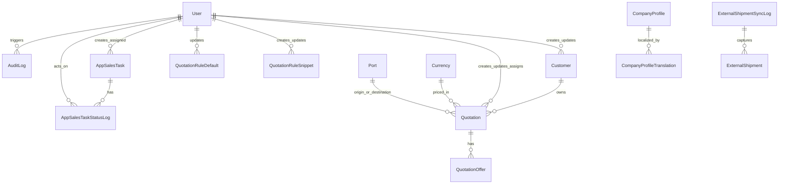

# Tuushin CRM - Харилцагчид өгөх системийн баримт бичиг

## 1) Товч танилцуулга

Tuushin CRM нь тээвэр, логистикийн үнийн санал удирдах вэб систем юм.  
Энэхүү систем нь `Next.js` + `PostgreSQL` + `Prisma` технологид суурилсан.

Системийн үндсэн зорилго:

- харилцагчийн үнийн санал бүртгэх, засах, хэвлэх
- борлуулалтын уулзалт, явц хянах
- гадаад системээс тээврийн мэдээлэл автоматаар татах
- мастер өгөгдөл (улс, боомт, менежер, инкотерм гэх мэт) синк хийх
- хэрэглэгч, эрх, аудитын бүртгэлийг найдвартай хөтлөх

Энэ баримт бичиг нь код хүлээлгэн өгөх, техникийн аудит хийх, шинэ баг систем хүлээж авах үед ашиглах зориулалттай.

## 2) Ашигласан технологи

- Вэб платформ: `Next.js` (App Router)
- Програмчлалын хэл: `TypeScript`
- Өгөгдлийн сан: `PostgreSQL`
- ORM: `Prisma`
- Нэвтрэлт: `next-auth` (credentials төрөл)
- UI: Tailwind CSS + Radix UI
- Validation: `zod`
- Тест: `vitest`

## 3) Системийн ерөнхий архитектур

Систем нь нэг `Next.js` апп дотор дараах давхаргаар ажиллана:

- Дэлгэцийн хэсэг (Dashboard, Тайлан, Үнийн санал, Тохиргоо)
- API route (бизнес логик болон өгөгдөл боловсруулах хэсэг)
- `src/lib/**` дотор байрлах shared service логик
- `prisma/schema.prisma` дээрх реляц өгөгдлийн модель

Кодын үндсэн байршлууд:

- UI: `src/app/(dashboard)/**`, `src/app/(auth)/**`, `src/app/(print)/**`
- API: `src/app/api/**/route.ts`
- Домайн сервис: `src/lib/external-shipments.ts`, `src/lib/master-sync.ts`, `src/lib/quotations/**`
- Нэвтрэлт/эрх: `src/lib/auth.ts`, `src/lib/permissions.ts`
- DB client: `src/lib/db.ts`

## 4) Бизнес модулиуд

### 4.1 Хэрэглэгчийн нэвтрэлт ба эрхийн удирдлага

- Хэрэглэгч `users` хүснэгттэй тулгаж нэвтэрнэ.
- Нууц үг `bcrypt`-ээр баталгаажна.
- Сесс нь JWT суурьтай.
- Эрхийн матриц: `ADMIN`, `MANAGER`, `SALES`.
- Мэдрэмтгий API бүр дээр эрхийн шалгалт заавал хийгддэг.

### 4.2 Үнийн саналын модуль

- Үнийн санал үүсгэх, засах, жагсаах, хэвлэх ажиллагааг дэмжинэ.
- UI-д хурдан ажиллахын тулд үндсэн бичлэг `app_quotations` дээр JSON payload-той хадгалагдана.
- Ирээдүйн өргөтгөлд зориулж нормчлогдсон `quotations` + `quotation_offers` хүснэгт рүү давхар бүртгэх оролдлого хийгддэг.
- Include/Exclude/Remark текстүүдийг тусгай мастер ба rule модуль удирддаг.

### 4.3 Харилцагчийн модуль

- Харилцагчийн үндсэн өгөгдөл `customers` хүснэгтэд хадгалагдана.
- Нормчлогдсон үнийн санал нь `customerId`-аар харилцагчтай холбогдоно.
- `createdBy`, `updatedBy` талбаруудаар хэн үүсгэсэн/зассаныг хянадаг.

### 4.4 Мастер өгөгдлийн синк

- Гадаад эх сурвалжаас reference өгөгдөл татаж `master_options` хүснэгтэд буулгана.
- Категориуд: `TYPE`, `OWNERSHIP`, `COUNTRY`, `PORT`, `SALES`, `MANAGER`, `INCOTERM` гэх мэт.
- Sync процесс нь upsert хийж, хуучирсан мөрүүдийг `isActive=false` болгож идэвхгүй болгоно.

### 4.5 Гадаад тээврийн синк ба тайлан

- `IMPORT`, `TRANSIT`, `EXPORT` ангиллаар тээврийн мэдээлэл татна.
- Давхардлыг тогтвортой external identifier-оор шүүнэ.
- Үр дүнг `external_shipments` хүснэгтэд хадгална.
- Sync бүрийн лог, дүнг `external_shipment_sync_logs` хүснэгтэд хөтөлнө.

### 4.6 Борлуулалтын даалгаврын модуль

- Уулзалт, утас, follow-up зэрэг ажиллагаа `app_sales_tasks` дээр хадгалагдана.
- Статусын түүх `app_sales_task_status_logs` дээр бүртгэгдэнэ.
- Менежерт оноолт хийх, хэн ямар өөрчлөлт хийснийг audit-лах боломжтой.

### 4.7 Аудит ба мөрдөх чадвар

- Чухал үйлдлүүд `audit_logs` хүснэгтэд бичигддэг.
- Нэвтрэлтийн оролдлого, sync ажиллагаа, гол өөрчлөлтүүд metadata-тай үлдэнэ.

## 5) Өгөгдлийн сангийн бүтэц

### 5.1 Хүснэгтийн бүлгүүд

#### A. Хэрэглэгч ба аюулгүй байдал

- `users`: хэрэглэгчийн бүртгэл, роль, идэвхтэй эсэх
- `audit_logs`: үйлдлийн түүх (хэзээ, хэн, юу хийсэн)

#### B. Үндсэн бизнес өгөгдөл

- `customers`: харилцагч
- `quotations`: нормчлогдсон үнийн санал
- `quotation_offers`: саналын доторх offer мөрүүд
- `app_quotations`: UI-д ашиглагдах lightweight бүртгэл
- `app_quotation_drafts`: түр хадгалсан draft

#### C. Текст ба дүрмийн өгөгдөл

- `quotation_texts`: include/exclude/remark мастер текст
- `quotation_rule_snippets`: нөхцөлт (incoterm/transport mode) текстийн дүрэм
- `quotation_rule_defaults`: default rule холбоосууд

#### D. Лавлах болон мастер өгөгдөл

- `ports`
- `currencies`
- `master_options`

#### E. Гадаад синк ба KPI

- `external_shipments`
- `external_shipment_sync_logs`
- `sales_kpi_measurements`

#### F. Компанийн профайл

- `company_profiles`
- `company_profile_translations`

#### G. Борлуулалтын үйл ажиллагаа

- `app_sales_tasks`
- `app_sales_task_status_logs`

### 5.2 Entity Relationship Diagram (ERD)

### 5.3 Гол холбоосууд (FK тайлбар)

- `quotation_offers.quotationId -> quotations.id` (`onDelete: Cascade`)
- `app_sales_task_status_logs.taskId -> app_sales_tasks.id` (`onDelete: Cascade`)
- `external_shipments.syncLogId -> external_shipment_sync_logs.id`
- `quotations.customerId -> customers.id`
- `quotations.userId -> users.id`
- `quotations.updatedBy/assignedTo -> users.id` (хоосон байж болно)
- `quotations.originPortId/destinationPortId -> ports.id` (хоосон байж болно)
- `quotations.currencyId -> currencies.id`

## 6) Гол API-ууд (бизнес хэрэглээнд)

### Нэвтрэлт

- `POST /api/auth/[...nextauth]`
- `POST /api/auth/register`

### Үнийн санал

- `GET/POST /api/quotations`
- `GET/PATCH/DELETE /api/quotations/[id]`
- `GET/POST /api/quotations/drafts`
- `GET/PATCH/DELETE /api/quotations/drafts/[id]`

### Харилцагч

- `GET/POST /api/customers`

### Хэрэглэгч

- `GET/POST /api/users`
- `PATCH/DELETE /api/users/[id]`
- `POST /api/users/[id]/reset-password`

### Мастер өгөгдөл

- `POST /api/master/sync`
- `POST /api/master/provision-users`
- `GET /api/master`
- `GET /api/master/[slug]`

### Гадаад тээвэр

- `POST /api/external-shipments/sync`
- `POST/GET /api/external-shipments/cron`
- `GET /api/external-shipments/logs`

### Тайлан

- `GET /api/reports/quotations`
- `GET /api/reports/external-shipments`
- `GET /api/reports/external-shipments/by-transmode`

### Sales task

- `GET/POST /api/sales-tasks`
- `GET/PATCH/DELETE /api/sales-tasks/[id]`
- `POST /api/sales-tasks/[id]/status`

## 7) Үндсэн бизнес процесс

### 7.1 Үнийн саналын урсгал

1. Хэрэглэгч UI дээрээс үнийн санал үүсгэнэ.
2. API нь өгөгдөл болон эрхийг шалгана.
3. `app_quotations` хүснэгтэд үндсэн бичлэг хадгална.
4. Боломжтой тохиолдолд нормчлогдсон `quotations` болон `quotation_offers` руу давхар бичнэ.
5. Print дэлгэцээр харилцагчид өгөх баримтыг гаргана.

### 7.2 Мастер өгөгдлийн урсгал

1. Sync endpoint гадаад эх үүсвэрээс өгөгдөл татна.
2. Өгөгдлийг `master_options` категорийн бүтэц рүү хөрвүүлнэ.
3. Байгаа мөрүүдийг шинэчилж, байхгүй болсон мөрийг идэвхгүй болгоно.

### 7.3 Гадаад тээврийн урсгал

1. Эрхтэй хэрэглэгч ангилал/огноо/фильтр сонгож sync ажиллуулна.
2. Upstream API-гаас pagination + retry логикоор өгөгдөл татна.
3. External ID-р давхардлыг цэвэрлэнэ.
4. `external_shipments` хүснэгтэд upsert хийнэ.
5. Sync-ийн дүн, статистикийг `external_shipment_sync_logs` дээр бүртгэнэ.

## 8) Роль ба эрхийн бодлого

- `ADMIN`: бүх тохиргоо, хэрэглэгч, тайлан, мастер, бүртгэлд бүрэн эрхтэй
- `MANAGER`: удирдлагын түвшний өргөн эрхтэй (ихэнх модульд бүрэн хандалттай)
- `SALES`: үнийн санал, sales task, dashboard хэсэгт ажлын хүрээний эрхтэй

Эрхийн шалгалт `hasPermission()` функцээр API бүр дээр хийгддэг.

## 9) Нэвтрүүлэлт ба орчны тохиргоо

### Заавал шаардлагатай орчны хувьсагч

- `DATABASE_URL`
- `DIRECT_URL`
- `NEXTAUTH_SECRET` эсвэл `AUTH_SECRET`
- `TUUSHIN_EXTERNAL_CRM_USERNAME`
- `TUUSHIN_EXTERNAL_CRM_PASSWORD`

### Нэмэлтээр тохируулахыг зөвлөж буй хувьсагч

- `MASTER_SYNC_API_KEY`
- `EXTERNAL_SHIPMENT_CRON_SECRET`
- `MASTER_SYNC_CONCURRENCY`

## 10) Үйл ажиллагааны зөвлөмж

- Гадаад тээврийн sync-ийг cron schedule-тай ажиллуулах
- Түлхүүрүүд болон нууц утгуудыг тогтмол эргүүлж шинэчлэх
- Өгөгдлийн сангийн backup бодлого, сэргээх тест тогтмол хийх
- Sync failed болон auth anomaly дээр автомат alert тавих
- CI орчинд `pnpm format`, `pnpm lint`, `pnpm test:run` ажиллуулах

## 11) Хүлээлгэн өгөх анхаарах зүйлс

- Системийн өгөгдлийн загварын эх сурвалж: `prisma/schema.prisma`
- `app_quotations` (lightweight) ба `quotations` (normalized) хоёр загвар зэрэгцэн ашиглагддаг
- Энэ архитектур нь одоогийн UI хурдыг хадгалах ба цааш бүрэн normalized загвар руу үе шаттай шилжих боломж олгодог
