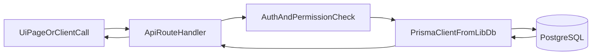

# Database and Next.js Guide

This guide explains how the Next.js app and PostgreSQL database work together in this codebase.

## 1) How Next.js works in this project

This repository uses Next.js App Router (`src/app`) with:

- UI routes/pages for browser rendering
- API route handlers in `src/app/api/*` for backend operations

There are no separate microservices here; API route handlers are the backend layer.

## 2) Database access pattern

The app uses Prisma as the ORM:

- Schema: `prisma/schema.prisma`
- Client singleton: `src/lib/db.ts`

Typical request flow:



## 3) Prisma schema and migration lifecycle

- Schema changes are made in `prisma/schema.prisma`.
- Migrations live under `prisma/migrations`.
- Seed script: `prisma/seed.ts`.

Normal development sequence:

```bash
pnpm prisma migrate dev
pnpm prisma generate
pnpm prisma db seed
```

Production-safe sequence:

```bash
pnpm prisma migrate deploy
pnpm start
```

## 4) Connection variables explained

- `DATABASE_URL`: primary Prisma runtime connection string
- `DIRECT_URL`: direct connection (used by Prisma for operations that should avoid pooled endpoints)

Migration helper script (`scripts/migrate-if-ready.mjs`) tries a fallback order among provider-specific env vars. Keep your deployment env explicit to avoid ambiguity.

## 5) Main database-backed domains

- Users, auth, and roles
- Quotations and offers
- Master options and rule defaults/snippets
- External shipment history and sync logs
- Sales tasks and status logs
- Audit logs

## 6) Important implementation details

### 6.1 Dual quotation persistence

Both models exist in the schema:

- `Quotation` (normalized)
- `AppQuotation` (payload JSON oriented)

When extending quotation features, check both paths to avoid data drift.

### 6.2 Sync endpoints and safety

- `POST /api/master/sync` can be open when `MASTER_SYNC_API_KEY` is not configured.
- `POST /api/external-shipments/cron` can be open when `EXTERNAL_SHIPMENT_CRON_SECRET` is not configured.

Always set these secrets in client production environments.

### 6.3 Health endpoint

- `GET /api/health/db` validates DB connectivity.
- Use this for deployment checks, but consider limiting public exposure if needed.

## 7) How to debug DB issues quickly

1. Confirm env vars are present and valid URLs.
2. Test DB health endpoint.
3. Run migration status/deploy commands.
4. Check app logs for Prisma errors.
5. Inspect recent migration SQL for breaking changes.

## 8) Change management rules for client team

- Treat schema changes as release-managed events.
- Require backup before destructive migration.
- Keep migration and app versioning aligned.
- Add integration tests for high-risk flows (auth, quotation write paths, sync jobs).
