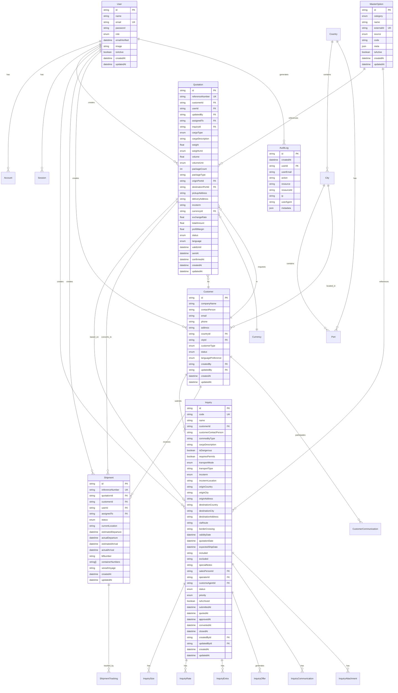
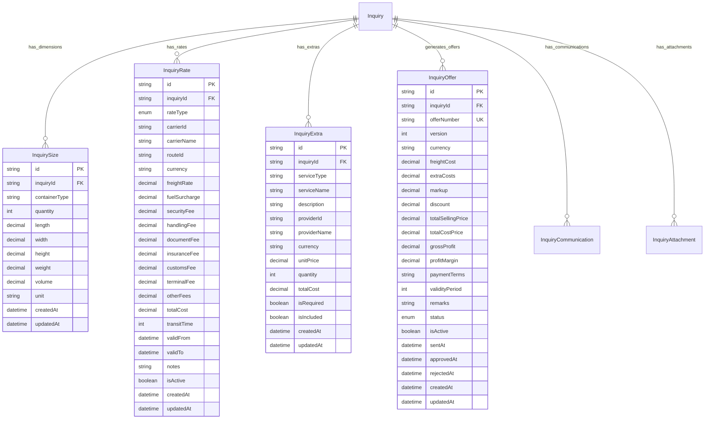
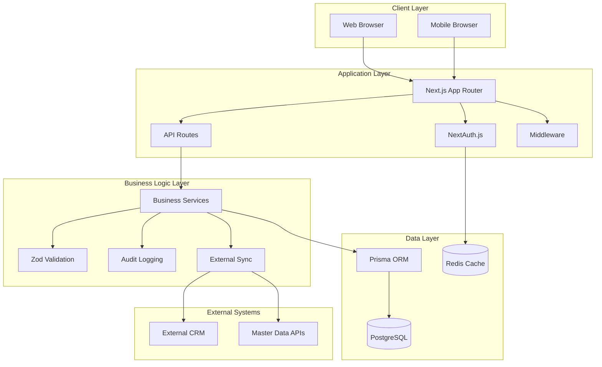
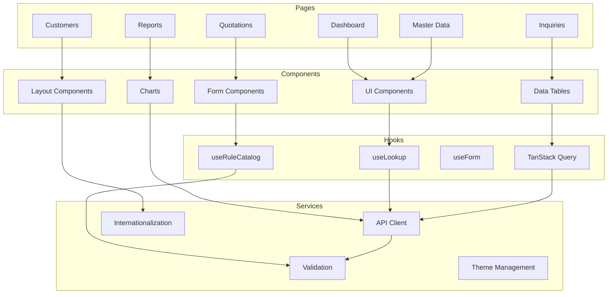
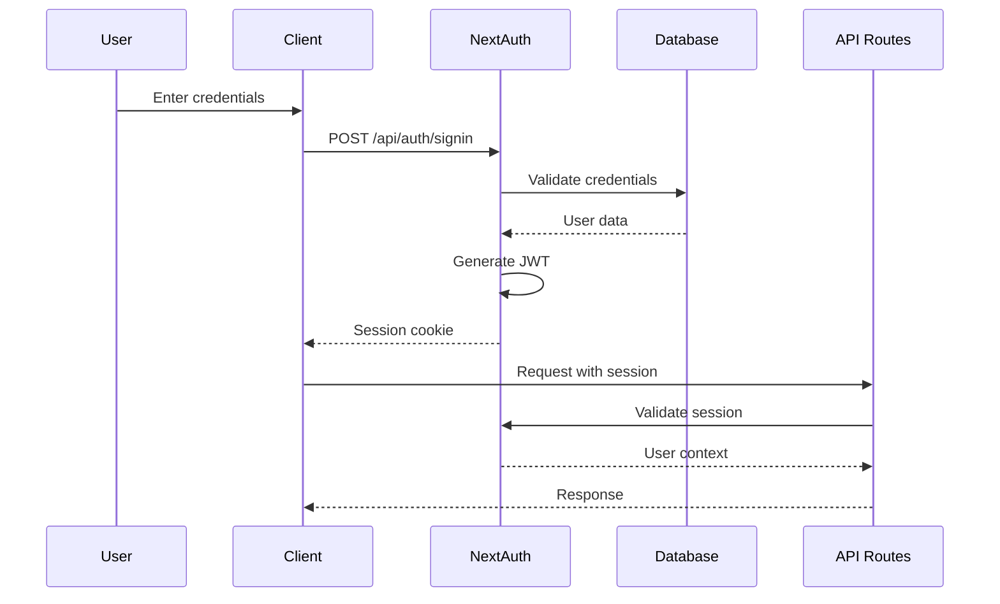
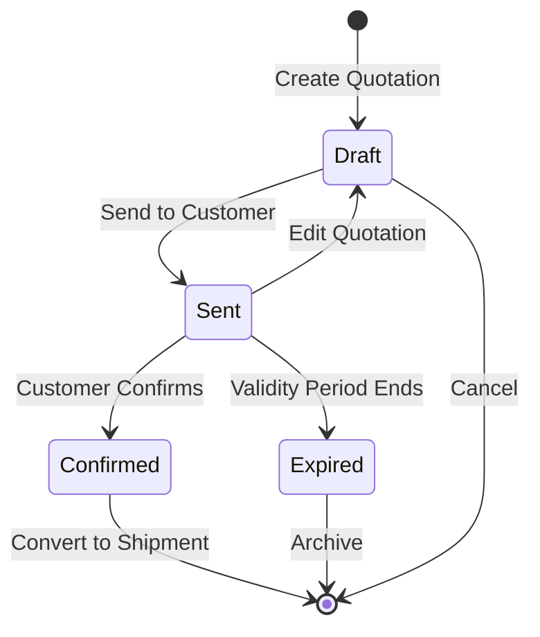
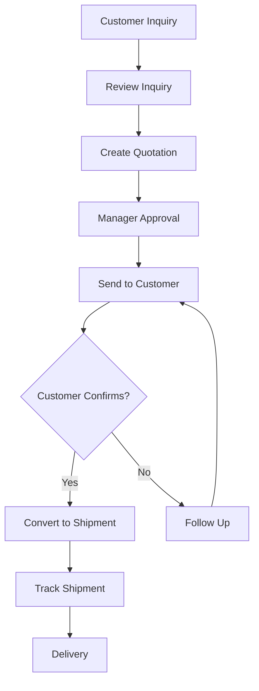
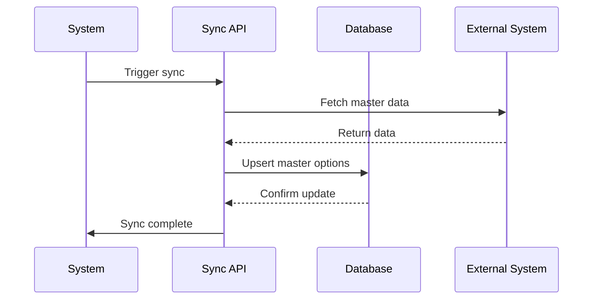
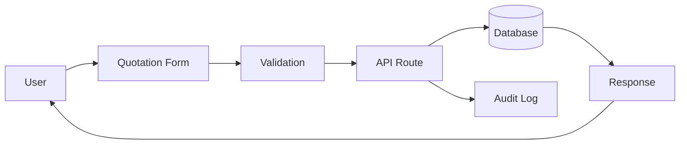
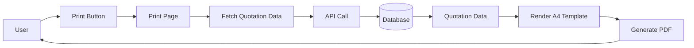

# ТУУШИН ХХК Freight CRM System Documentation

## Table of Contents

1. [System Overview](#system-overview)
2. [Technology Stack](#technology-stack)
3. [Database Schema](#database-schema)
4. [Entity Relationship Diagrams](#entity-relationship-diagrams)
5. [System Architecture](#system-architecture)
6. [API Documentation](#api-documentation)
7. [Authentication & Authorization](#authentication--authorization)
8. [Business Workflows](#business-workflows)
9. [Data Flow Diagrams](#data-flow-diagrams)
10. [Component Architecture](#component-architecture)

## System Overview

ТУУШИН ХХК Freight CRM is a comprehensive freight management system designed for Mongolian logistics company ТУУШИН ХХК. The system manages the complete freight lifecycle from inquiry to shipment delivery, including quotation management, customer relationships, and business analytics.

### Core Features

- **Customer Management**: Comprehensive customer database with communication tracking
- **Quotation System**: Full-featured quotation creation, editing, and PDF generation
- **Inquiry Management**: Structured inquiry workflow with rate management
- **Shipment Tracking**: Real-time shipment status and tracking events
- **Master Data Sync**: External system integration for reference data
- **Audit Logging**: Complete system activity tracking
- **Multi-language Support**: English and Mongolian language support
- **Role-based Access Control**: Granular permissions system

## Technology Stack

### Backend

- **Framework**: Next.js 15.4.2 with App Router
- **Database**: PostgreSQL with Prisma ORM
- **Authentication**: NextAuth.js with JWT strategy
- **Validation**: Zod schema validation
- **API**: RESTful API with Next.js Route Handlers

### Frontend

- **Framework**: React 19.1.0 with TypeScript
- **Styling**: Tailwind CSS 4.0 with shadcn/ui components
- **State Management**: Zustand for client state, TanStack Query for server state
- **Forms**: React Hook Form with Zod validation
- **Data Tables**: TanStack Table with advanced filtering
- **Icons**: Lucide React
- **Animations**: Framer Motion

### DevOps & Tools

- **Package Manager**: pnpm
- **Linting**: ESLint with Prettier
- **Type Checking**: TypeScript 5
- **Database Migrations**: Prisma migrations
- **Docker**: Containerized deployment
- **Git Hooks**: Husky with lint-staged

## Database Schema

### Core Entities

The database is organized into several main domains:

1. **User Management & Authentication**
2. **Location & Reference Data**
3. **Customer Management**
4. **Quotation Management**
5. **Inquiry & Quotation System**
6. **Shipment Management**
7. **External System Integration**
8. **System Configuration**
9. **Audit & Logging**

## Entity Relationship Diagrams

### Main System Entities



### Inquiry System Detail



## System Architecture

### High-Level Architecture



### Component Architecture



## API Documentation

### Authentication Endpoints

| Method | Endpoint             | Description         | Auth Required |
| ------ | -------------------- | ------------------- | ------------- |
| POST   | `/api/auth/register` | User registration   | No            |
| POST   | `/api/auth/signin`   | User login          | No            |
| POST   | `/api/auth/signout`  | User logout         | Yes           |
| GET    | `/api/auth/session`  | Get current session | Yes           |

### Quotation Endpoints

| Method | Endpoint               | Description                     | Auth Required |
| ------ | ---------------------- | ------------------------------- | ------------- |
| GET    | `/api/quotations`      | List quotations with pagination | Yes           |
| POST   | `/api/quotations`      | Create new quotation            | Yes           |
| GET    | `/api/quotations/[id]` | Get quotation details           | Yes           |
| PUT    | `/api/quotations/[id]` | Update quotation                | Yes           |
| DELETE | `/api/quotations/[id]` | Delete quotation                | Yes           |

### Customer Endpoints

| Method | Endpoint              | Description          | Auth Required |
| ------ | --------------------- | -------------------- | ------------- |
| GET    | `/api/customers`      | List customers       | Yes           |
| POST   | `/api/customers`      | Create customer      | Yes           |
| GET    | `/api/customers/[id]` | Get customer details | Yes           |
| PUT    | `/api/customers/[id]` | Update customer      | Yes           |

### Master Data Endpoints

| Method | Endpoint             | Description                 | Auth Required |
| ------ | -------------------- | --------------------------- | ------------- |
| GET    | `/api/master`        | List master options         | Yes           |
| POST   | `/api/master`        | Create master option        | Yes           |
| GET    | `/api/lookup/[slug]` | Get lookup data by category | Yes           |
| POST   | `/api/master/sync`   | Sync external master data   | Yes           |

### Utility Endpoints

| Method | Endpoint         | Description           | Auth Required |
| ------ | ---------------- | --------------------- | ------------- |
| GET    | `/api/health/db` | Database health check | No            |
| GET    | `/api/audit`     | Get audit logs        | Yes           |

## Authentication & Authorization

### User Roles

```mermaid
graph TD
    SUPER_ADMIN[SUPER_ADMIN]
    ADMIN[ADMIN]
    MANAGER[MANAGER]
    USER[USER]
    SALES[SALES]

    SUPER_ADMIN --> ADMIN
    ADMIN --> MANAGER
    MANAGER --> USER
    MANAGER --> SALES

    SUPER_ADMIN -.-> "Full System Access"
    ADMIN -.-> "User Management + All Features"
    MANAGER -.-> "Team Management + Quotations"
    USER -.-> "Basic Operations"
    SALES -.-> "Sales Activities Only"
```

### Permission Matrix

| Feature         | SUPER_ADMIN | ADMIN | MANAGER | USER | SALES |
| --------------- | ----------- | ----- | ------- | ---- | ----- |
| Dashboard       | ✅          | ✅    | ✅      | ✅   | ✅    |
| Quotations      | ✅          | ✅    | ✅      | ✅   | ✅    |
| Inquiries       | ✅          | ✅    | ✅      | ✅   | ✅    |
| Customers       | ✅          | ✅    | ✅      | ✅   | ✅    |
| Reports         | ✅          | ✅    | ✅      | ✅   | ❌    |
| Master Data     | ✅          | ✅    | ✅      | ❌   | ❌    |
| User Management | ✅          | ✅    | ❌      | ❌   | ❌    |
| System Settings | ✅          | ❌    | ❌      | ❌   | ❌    |

### Authentication Flow



## Business Workflows

### Quotation Workflow



### Inquiry to Quotation Flow



### Master Data Sync Flow



## Data Flow Diagrams

### Quotation Creation Flow



### Print Generation Flow



## Component Architecture

### UI Component Hierarchy

```
App Layout
├── Dashboard Layout
│   ├── Header
│   │   ├── Logo
│   │   ├── Navigation
│   │   ├── User Menu
│   │   └── Language Switcher
│   ├── Sidebar
│   │   └── Navigation Menu
│   └── Main Content
│       ├── Page Header
│       └── Page Content
└── Print Layout
    └── Print Content
```

### Form Components

```
Form Components
├── Input Fields
│   ├── Text Input
│   ├── Select Dropdown
│   ├── Date Picker
│   └── File Upload
├── Complex Fields
│   ├── ComboBox (Searchable)
│   ├── Multi-Select
│   └── Rich Text Editor
└── Form Layout
    ├── Field Groups
    ├── Validation Messages
    └── Submit Actions
```

### Data Table Components

```
Data Table
├── Table Header
│   ├── Column Headers
│   ├── Sort Controls
│   └── Filter Controls
├── Table Body
│   ├── Data Rows
│   ├── Pagination
│   └── Loading States
└── Table Actions
    ├── Row Actions
    ├── Bulk Actions
    └── Export Options
```

## Development Guidelines

### Code Organization

```
src/
├── app/                    # Next.js App Router
│   ├── (auth)/            # Auth route group
│   ├── (dashboard)/       # Dashboard route group
│   ├── (print)/           # Print route group
│   └── api/               # API routes
├── components/            # Reusable components
│   ├── ui/                # Base UI components
│   ├── forms/             # Form components
│   ├── tables/            # Data table components
│   └── layout/            # Layout components
├── lib/                   # Utility libraries
│   ├── auth.ts            # Authentication
│   ├── db.ts              # Database connection
│   ├── validations.ts     # Zod schemas
│   └── utils.ts           # Helper functions
└── types/                 # TypeScript types
```

### Database Best Practices

1. **Use proper indexing** on frequently queried fields
2. **Implement soft deletes** for important data
3. **Use transactions** for multi-table operations
4. **Audit all changes** through the audit log system
5. **Validate data** at both API and database levels

### API Design Principles

1. **RESTful endpoints** with consistent naming
2. **Comprehensive error handling** with proper HTTP status codes
3. **Input validation** using Zod schemas
4. **Rate limiting** for public endpoints
5. **Audit logging** for all operations

### Security Considerations

1. **Authentication** via NextAuth.js with JWT
2. **Authorization** through role-based permissions
3. **Input sanitization** and validation
4. **SQL injection prevention** via Prisma ORM
5. **Audit trails** for compliance

---

## Conclusion

This documentation provides a comprehensive overview of the ТУУШИН ХХК Freight CRM system. The system is designed with scalability, maintainability, and user experience in mind, using modern web technologies and best practices.

For technical support or questions about the system architecture, please refer to the development team or consult the inline code documentation.
